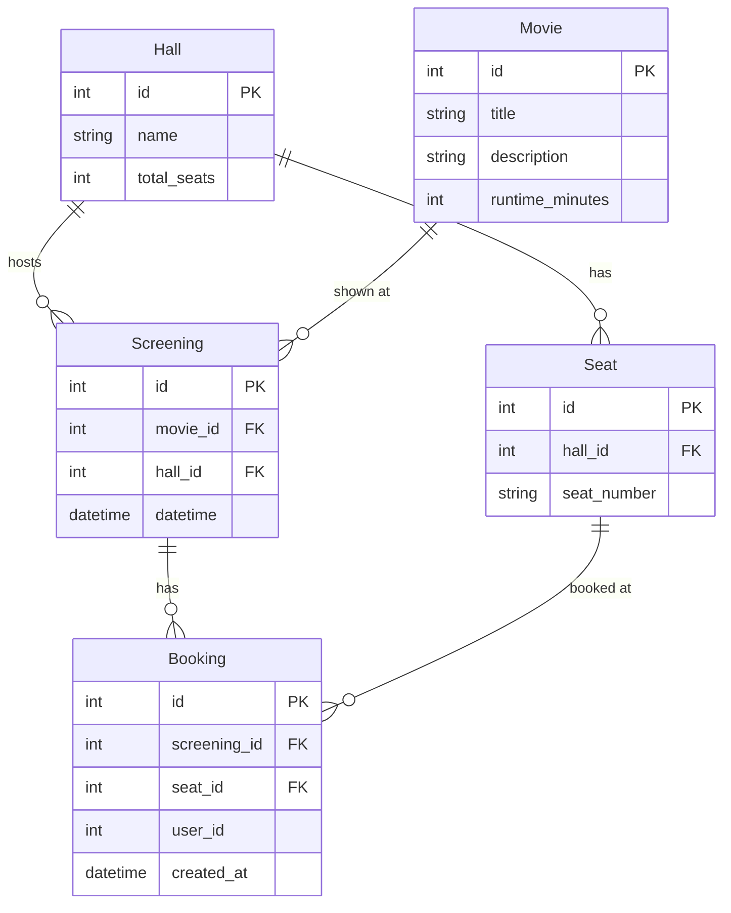

# booking-service

FastAPI 기반 영화 예매 서비스.

## DB 관계도

> `Booking.user_id`는 auth-service의 users 테이블을 가리키지만,
> 서비스가 분리되어 있어 DB 레벨 FK 제약은 없음. JWT에서 파싱한 값을 저장.
>
> `Booking(screening_id, seat_id)`에 유니크 제약 — 같은 상영의 같은 좌석은 중복 예매 불가.
> 같은 좌석(Seat)이라도 다른 상영(Screening)에서는 다시 예매 가능.
